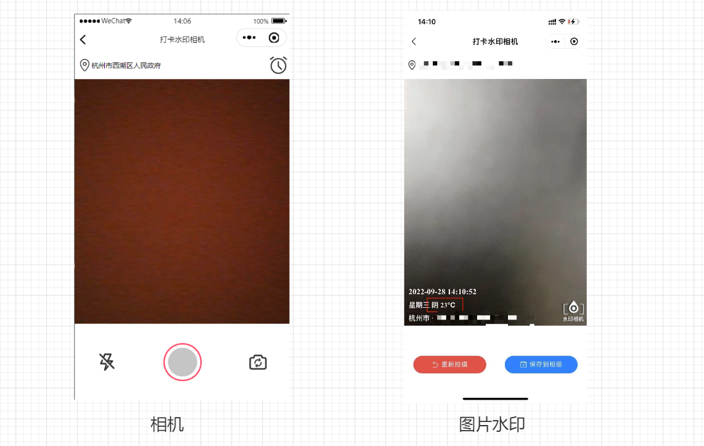
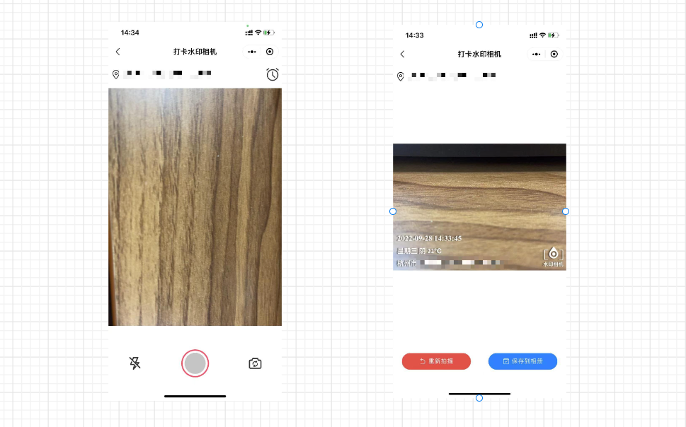
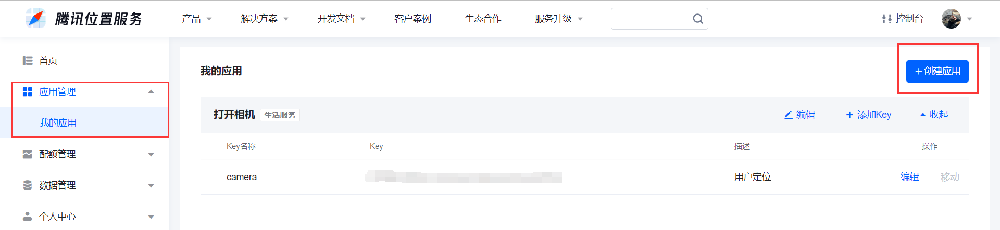
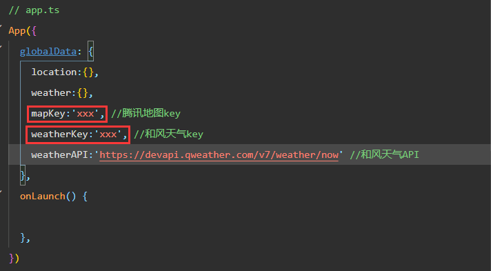

# KA-Camera

#### 项目地址
Gitee：[https://gitee.com/i-like-potato-chips/ka-camera](https://gitee.com/i-like-potato-chips/ka-camera)

GitHub：[http://https://github.com/tiancheng2002/KA-Camera](http://https://github.com/tiancheng2002/KA-Camera)

演示环境：

#### 介绍

KA-Camera是一个简单的打卡水印小程序，通过用户的定位，将地点、天气、时间等信息已水印的方式添加到图片上，为工作考勤水印拍照相机

可以根据手机的旋转角度位置自动调整对应的方向，竖着、横着和倒着到最后添加水印完成的时候都会已我们习惯的竖着拿手机的方式呈现

- 竖着拍

- 横着拍

#### 运行说明

1.  下载代码到本地

2.  申请腾讯地图位置的key
- 访问腾讯位置服务官网，然后登录之后点击上方导航栏的控制台

- 接着点击"应用管理"-"我的应用"-"创建应用"，填写完信息之后就会生成对应的key

- 天气API我用的是和风天气API，然后一样在控制台的应用中心创建应用获取对应的key，这个可以根据自己的来
3.  修改app.ts文件中的属性

## 微信公众号

